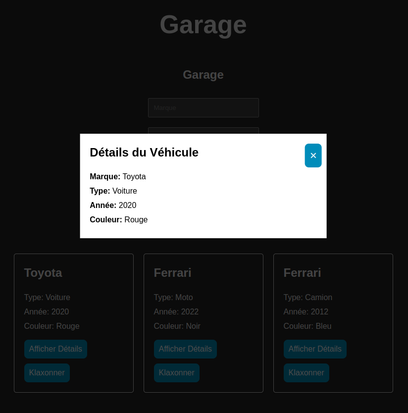

# GARAGE REACT

Ce projet est une application qui représente un garage dans lequel il est possible de stocké des voitures,camions et motos

## Fonctionnalités

- Ajouter des véhicules (voiture, camion, moto) avec des détails spécifiques.
- Afficher les détails des véhicules dans une fenêtre modale.
- Gérer une collection de véhicules et afficher un message lorsque le garage est vide.

## Illustrations

Illustration de l'application

Illustration d'une erreur

Illustration du Garage

Illustration d'une Modal

Ajout du bouton supprimé

